# Event Booking System - Code Architecture Diagrams

## Comprehensive Visual Guide to the Codebase

This document provides Mermaid diagrams illustrating the code structure, relationships, and design patterns in the Event Booking System.

---

## Table of Contents

1. [Clean Architecture Layers](#clean-architecture-layers)
2. [Domain Model Class Diagram](#domain-model-class-diagram)
3. [Event Type Hierarchy](#event-type-hierarchy)
4. [Strategy Pattern Implementation](#strategy-pattern-implementation)
5. [Validator Pattern Implementation](#validator-pattern-implementation)
6. [Repository Pattern Architecture](#repository-pattern-architecture)
7. [Application Service Flow](#application-service-flow)
8. [Mapper Pattern](#mapper-pattern)
9. [Dependency Injection Container](#dependency-injection-container)
10. [Request Flow Sequence Diagrams](#request-flow-sequence-diagrams)

---

## Clean Architecture Layers

### Layer Dependencies

```mermaid
graph TB
    subgraph "Presentation Layer (Future)"
        API[Web API / UI]
    end
    
    subgraph "Application Layer"
        AppServices[Application Services]
        DTOs[DTOs]
        Commands[Commands]
        Validators[Command Validators]
        QueryServices[Query Services]
    end
    
    subgraph "Domain Layer"
        Entities[Domain Entities]
        DomainServices[Domain Services]
        DomainInterfaces[Domain Interfaces]
        ValueObjects[Value Objects]
        Strategies[Strategy Implementations]
    end
    
    subgraph "Infrastructure Layer"
        Repositories[Repository Implementations]
        DataAccess[Data Access (Dapper)]
        Mappers[Entity-DTO Mappers]
        DbModels[Database DTOs]
    end
    
    subgraph "External"
        Database[(SQLite Database)]
    end
    
    API --> AppServices
    API --> QueryServices
    
    AppServices --> DomainServices
    AppServices --> Repositories
    QueryServices --> Repositories
    
    Repositories --> DataAccess
    Repositories --> Mappers
    DataAccess --> Database
    
    DomainServices --> Entities
    DomainServices --> DomainInterfaces
    DomainServices --> Strategies
    
    Mappers --> Entities
    Mappers --> DbModels
    
    style Domain Layer fill:#c8e6c9
    style Application Layer fill:#fff9c4
    style Infrastructure Layer fill:#b3e5fc
    style External fill:#ffccbc
```

### Project Structure


---

## Domain Model Class Diagram

### Core Entities and Relationships


---

## Event Type Hierarchy

### Inheritance and Polymorphism


### Event Type Strategy Mapping


---

## Strategy Pattern Implementation

### Reservation Strategy Pattern


---

## Validator Pattern Implementation

### Booking Validator Composition


### Validator Workflow


---

## Repository Pattern Architecture

### Repository Interfaces and Implementations


### Repository Data Flow


---

## Application Service Flow

### Booking Application Service Architecture

```mermaid
classDiagram
    class BookingApplicationService {
        -IBookingRepository _bookingRepository
        -IEventRepository _eventRepository
        -IUserRepository _userRepository
        -IVenueRepository _venueRepository
        -IBookingService _bookingService
        -IPaymentService _paymentService
        
        +Task~BookingResultDto~ CreateBookingAsync(CreateBookingCommand, CancellationToken)
        -Task~ValidationResult~ ValidateCommandAsync(CreateBookingCommand)
        -Task~EntityLoadResult~ LoadRequiredEntitiesAsync(CreateBookingCommand)
        -ReservationRequest BuildReservationRequest(CreateBookingCommand)
        -Task~PaymentResult~ ProcessPaymentAsync(Booking, EventBase)
        -Task~PersistenceResult~ PersistBookingAsync(Booking, EventBase)
        -BookingResultDto MapToResultDto(Booking)
    }
    
    class CreateBookingCommand {
        +int UserId
        +int EventId
        +int Quantity
        +int? SectionId
        +int? SeatId
    }
    
    class BookingResultDto {
        +int BookingId
        +string UserName
        +string EventName
        +string BookingType
        +decimal TotalAmount
        +string PaymentStatus
        +DateTime CreatedAt
    }
    
    class IBookingService {
        <<interface>>
        +Booking CreateBooking(User, EventBase, ReservationRequest)
        +ValidationResult ValidateBooking(User, EventBase, ReservationRequest)
    }
    
    class IPaymentService {
        <<interface>>
        +Task~PaymentResult~ ProcessPaymentAsync(PaymentRequest, CancellationToken)
    }
    
    class IBookingRepository {
        <<interface>>
        +Task~Booking~ AddAsync(Booking, CancellationToken)
    }
    
    class IEventRepository {
        <<interface>>
        +Task~EventBase?~ GetByIdWithDetailsAsync(int, CancellationToken)
        +Task~EventBase~ UpdateAsync(EventBase, CancellationToken)
    }
    
    class IUserRepository {
        <<interface>>
        +Task~User?~ GetByIdAsync(int, CancellationToken)
    }
    
    class IVenueRepository {
        <<interface>>
        +Task~Venue?~ GetByIdWithDetailsAsync(int, CancellationToken)
    }
    
    BookingApplicationService --> CreateBookingCommand : receives
    BookingApplicationService --> BookingResultDto : returns
    BookingApplicationService --> IBookingService : uses
    BookingApplicationService --> IPaymentService : uses
    BookingApplicationService --> IBookingRepository : uses
    BookingApplicationService --> IEventRepository : uses
    BookingApplicationService --> IUserRepository : uses
    BookingApplicationService --> IVenueRepository : uses
    
    note for BookingApplicationService "SRP: Each private method\nhas single responsibility.\nDIP: All dependencies\nare abstractions."
```



### Booking Creation Workflow


---

## Mapper Pattern

### Entity-DTO Mapping Architecture


### Mapper Usage in Repository


---

## Dependency Injection Container

### Service Registration


### Dependency Resolution Example


---

## Request Flow Sequence Diagrams

### Complete Booking Flow


### Query Service Flow


---

## Design Pattern Summary

### Patterns Used in the System


---

## Key Architectural Benefits

### SOLID Principles Visualization


---

## Related Documentation

- ?? **[SOLID-Principles-Overview.md](./SOLID-Principles-Overview.md)** - SOLID principles explained
- ?? **[DesignPrinciples.md](./DesignPrinciples.md)** - Comprehensive design guide
- ?? **[DatabaseSchema-Diagram.md](./DatabaseSchema-Diagram.md)** - Database structure
- ?? **[EventQueryServiceDocumentation.md](./EventQueryServiceDocumentation.md)** - Query service details
- ?? **[BookingQueryServiceDocumentation.md](./BookingQueryServiceDocumentation.md)** - Booking queries

---

**Document Version:** 1.0  
**Last Updated:** 2025-01-XX  
**Target Framework:** .NET 10, C# 14.0  
**Architecture:** Clean Architecture with SOLID Principles
