# Event Booking System - Database Relationships Guide

## Visual Guide to Table Relationships

This document provides detailed visualizations of all relationships in the Event Booking System database schema, highlighting cardinality, cascade behaviors, and constraint patterns.

---

## Table of Contents

1. [Complete Relationship Overview](#complete-relationship-overview)
2. [Venue Hierarchy Relationships](#venue-hierarchy-relationships)
3. [Event Type Relationships](#event-type-relationships)
4. [Booking Relationships](#booking-relationships)
5. [Polymorphic Relationships](#polymorphic-relationships)
6. [Cascade Delete Chain](#cascade-delete-chain)
7. [Constraint Patterns](#constraint-patterns)
8. [Relationship Summary Table](#relationship-summary-table)

---

## Complete Relationship Overview

### Master Entity Relationship Diagram

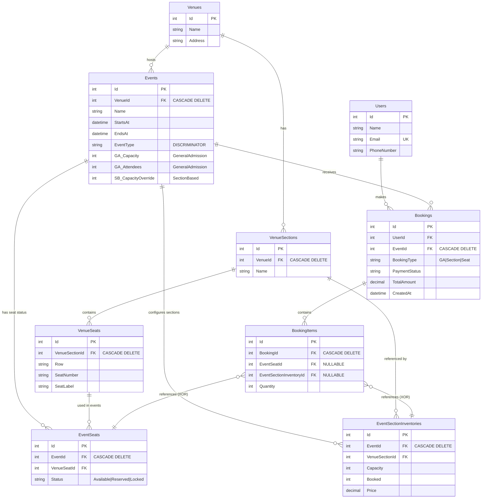

---

## Venue Hierarchy Relationships

### Physical Infrastructure Chain

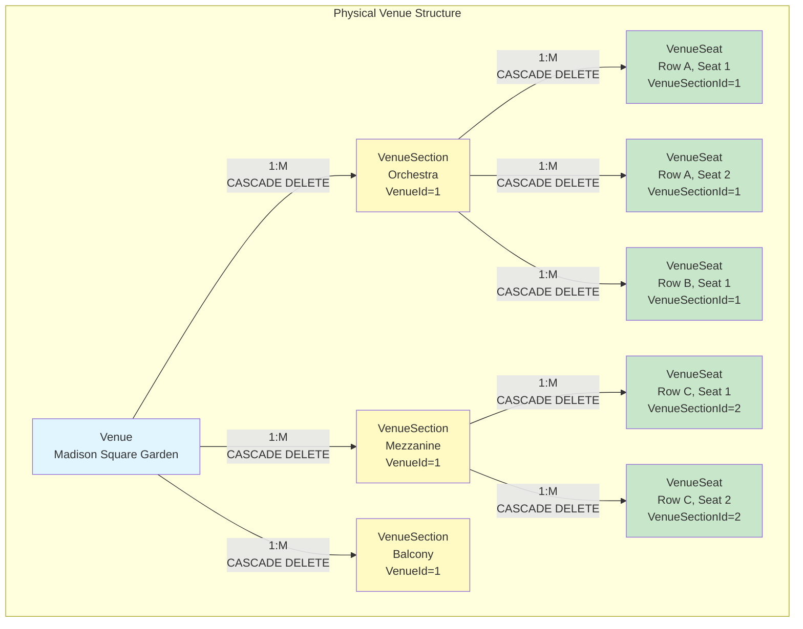

**Relationship Details:**

| Parent | Child | Type | Cardinality | Delete Behavior | Constraint |
|--------|-------|------|-------------|-----------------|------------|
| **Venues** | **VenueSections** | Composition | 1:Many | CASCADE | Required (NOT NULL) |
| **VenueSections** | **VenueSeats** | Composition | 1:Many | CASCADE | Required (NOT NULL) + UNIQUE(VenueSectionId, Row, SeatNumber) |

**Key Points:**
- ? **Composition**: Child cannot exist without parent
- ? **Cascade Delete**: Deleting venue removes all sections and seats
- ? **Unique Constraint**: No duplicate seats in same section (Row + SeatNumber)

---

## Event Type Relationships

### Event Configuration Patterns

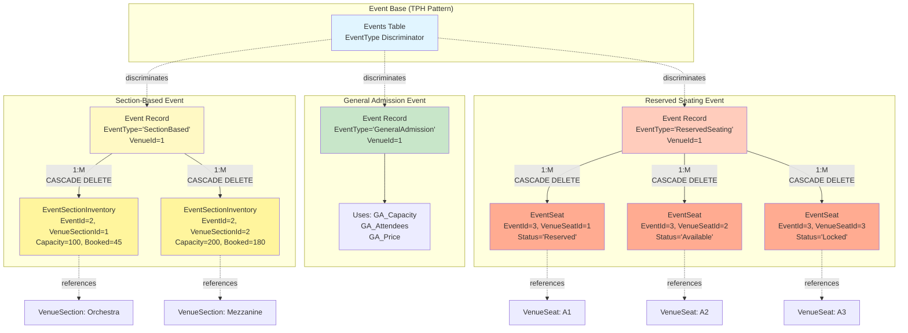

**Relationship Details:**

#### Events ? Venues
| Parent | Child | Type | Cardinality | Delete Behavior |
|--------|-------|------|-------------|-----------------|
| **Venues** | **Events** | Association | 1:Many | CASCADE |

#### Events ? EventSectionInventories (Section-Based Events)
| Parent | Child | Type | Cardinality | Delete Behavior | Constraint |
|--------|-------|------|-------------|-----------------|------------|
| **Events** | **EventSectionInventories** | Composition | 1:Many | CASCADE | UNIQUE(EventId, VenueSectionId) |
| **VenueSections** | **EventSectionInventories** | Reference | 1:Many | RESTRICT | Required (NOT NULL) |

#### Events ? EventSeats (Reserved Seating Events)
| Parent | Child | Type | Cardinality | Delete Behavior | Constraint |
|--------|-------|------|-------------|-----------------|------------|
| **Events** | **EventSeats** | Composition | 1:Many | CASCADE | UNIQUE(EventId, VenueSeatId) |
| **VenueSeats** | **EventSeats** | Reference | 1:Many | RESTRICT | Required (NOT NULL) |

**Key Points:**
- ? **TPH Pattern**: All event types in one table with discriminator
- ? **Conditional Composition**: Only relevant child records exist per event type
- ? **Reference Integrity**: Event-specific records reference physical venue structure
- ? **Unique Constraints**: One inventory per section per event; one status per seat per event

---

## Booking Relationships

### Customer Transaction Structure

```mermaid
graph TB
    subgraph "User Domain"
        U[User<br/>Id=1<br/>john@email.com]
    end
    
    subgraph "Booking Domain"
        B1[Booking<br/>Id=101<br/>UserId=1<br/>EventId=1<br/>BookingType='GA']
        B2[Booking<br/>Id=102<br/>UserId=1<br/>EventId=2<br/>BookingType='Section']
        B3[Booking<br/>Id=103<br/>UserId=1<br/>EventId=3<br/>BookingType='Seat']
    end
    
    subgraph "General Admission Booking Items"
        BI1[BookingItem<br/>BookingId=101<br/>Quantity=3<br/>EventSeatId=NULL<br/>EventSectionInventoryId=NULL]
    end
    
    subgraph "Section-Based Booking Items"
        BI2[BookingItem<br/>BookingId=102<br/>Quantity=2<br/>EventSeatId=NULL<br/>EventSectionInventoryId=5]
    end
    
    subgraph "Reserved Seating Booking Items"
        BI3[BookingItem<br/>BookingId=103<br/>Quantity=1<br/>EventSeatId=10<br/>EventSectionInventoryId=NULL]
        BI4[BookingItem<br/>BookingId=103<br/>Quantity=1<br/>EventSeatId=11<br/>EventSectionInventoryId=NULL]
    end
    
    U -->|"1:M"| B1
    U -->|"1:M"| B2
    U -->|"1:M"| B3
    
    B1 -->|"1:M<br/>CASCADE DELETE"| BI1
    B2 -->|"1:M<br/>CASCADE DELETE"| BI2
    B3 -->|"1:M<br/>CASCADE DELETE"| BI3
    B3 -->|"1:M<br/>CASCADE DELETE"| BI4
    
    BI2 -.references.-> ESI[EventSectionInventory<br/>Id=5]
    BI3 -.references.-> ES10[EventSeat<br/>Id=10]
    BI4 -.references.-> ES11[EventSeat<br/>Id=11]
    
    B1 -.for.-> E1[Event: GA Concert]
    B2 -.for.-> E2[Event: Theater Show]
    B3 -.for.-> E3[Event: Broadway]
    
    style U fill:#e1f5ff
    style B1 fill:#c8e6c9
    style B2 fill:#fff9c4
    style B3 fill:#ffccbc
    style BI1 fill:#a5d6a7
    style BI2 fill:#fff59d
    style BI3 fill:#ffab91
    style BI4 fill:#ffab91
```

**Relationship Details:**

#### Users ? Bookings
| Parent | Child | Type | Cardinality | Delete Behavior |
|--------|-------|------|-------------|-----------------|
| **Users** | **Bookings** | Association | 1:Many | RESTRICT (Not specified, default) |

#### Events ? Bookings
| Parent | Child | Type | Cardinality | Delete Behavior |
|--------|-------|------|-------------|-----------------|
| **Events** | **Bookings** | Association | 1:Many | CASCADE |

#### Bookings ? BookingItems
| Parent | Child | Type | Cardinality | Delete Behavior |
|--------|-------|------|-------------|-----------------|
| **Bookings** | **BookingItems** | Composition | 1:Many | CASCADE |

#### BookingItems ? Event-Specific Records (Polymorphic)
| Parent | Child | Type | Cardinality | Constraint |
|--------|-------|------|-------------|------------|
| **EventSeats** | **BookingItems** | Reference (Optional) | 1:Many | XOR: Either EventSeatId OR EventSectionInventoryId |
| **EventSectionInventories** | **BookingItems** | Reference (Optional) | 1:Many | XOR: Either EventSeatId OR EventSectionInventoryId |

**Key Points:**
- ? **User Association**: Users keep booking history (no cascade delete)
- ? **Event Cascade**: Deleting event removes all bookings
- ? **Booking Composition**: Deleting booking removes all items
- ? **Polymorphic Reference**: BookingItems reference different tables based on booking type
- ? **XOR Constraint**: Items reference either seats OR sections OR neither (GA), never both

---

## Polymorphic Relationships

### BookingItems XOR Pattern

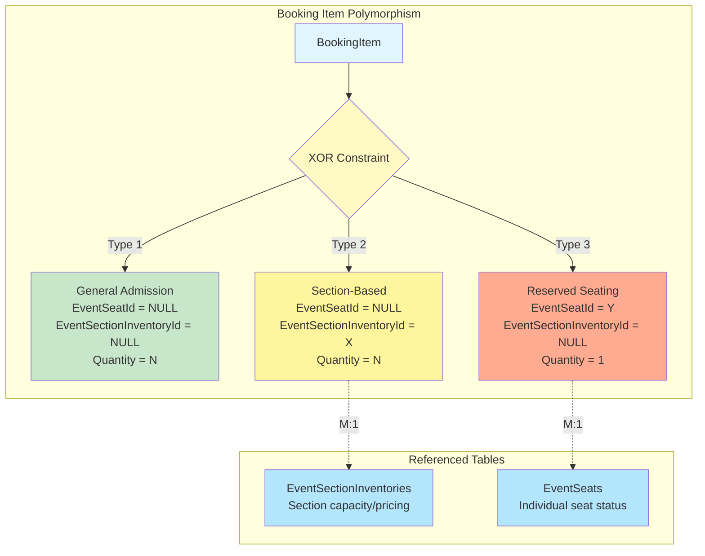

**XOR Constraint SQL:**
```sql
CHECK(
  (EventSeatId IS NOT NULL AND EventSectionInventoryId IS NULL) OR 
  (EventSeatId IS NULL AND EventSectionInventoryId IS NOT NULL) OR
  (EventSeatId IS NULL AND EventSectionInventoryId IS NULL)
)
```

**Three Valid States:**

| State | EventSeatId | EventSectionInventoryId | Quantity | Use Case |
|-------|-------------|-------------------------|----------|----------|
| **Type 1** | NULL | NULL | N | General Admission (no specific allocation) |
| **Type 2** | NULL | Not NULL | N | Section-Based (N tickets in section) |
| **Type 3** | Not NULL | NULL | 1 | Reserved Seating (specific seat) |

**Invalid State:**
| EventSeatId | EventSectionInventoryId | Result |
|-------------|-------------------------|--------|
| Not NULL | Not NULL | ? **CONSTRAINT VIOLATION** |

---

## Cascade Delete Chain

### Complete Deletion Cascade Flow

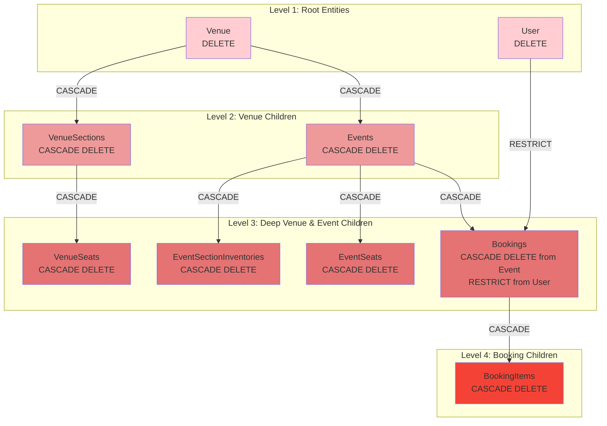

**Cascade Delete Chains:**

#### Chain 1: Venue Deletion
```
Venue (DELETE)
  ??? VenueSections (CASCADE)
       ??? VenueSeats (CASCADE)
  ??? Events (CASCADE)
       ??? EventSectionInventories (CASCADE)
       ??? EventSeats (CASCADE)
       ??? Bookings (CASCADE)
            ??? BookingItems (CASCADE)
```

#### Chain 2: Event Deletion
```
Event (DELETE)
  ??? EventSectionInventories (CASCADE)
  ??? EventSeats (CASCADE)
  ??? Bookings (CASCADE)
       ??? BookingItems (CASCADE)
```

#### Chain 3: VenueSection Deletion
```
VenueSection (DELETE)
  ??? VenueSeats (CASCADE)
```

#### Chain 4: Booking Deletion
```
Booking (DELETE)
  ??? BookingItems (CASCADE)
```

#### No Cascade: User Deletion
```
User (DELETE)
  ??? Bookings (RESTRICT - must be handled separately)
```

**Important Notes:**
- ?? **Venue deletion is catastrophic** - removes all events and bookings
- ?? **Event deletion removes customer bookings** - may need soft delete strategy
- ?? **User deletion is protected** - must manually handle bookings first
- ? **BookingItems always cascade** with parent booking

---

## Constraint Patterns

### Unique Constraints

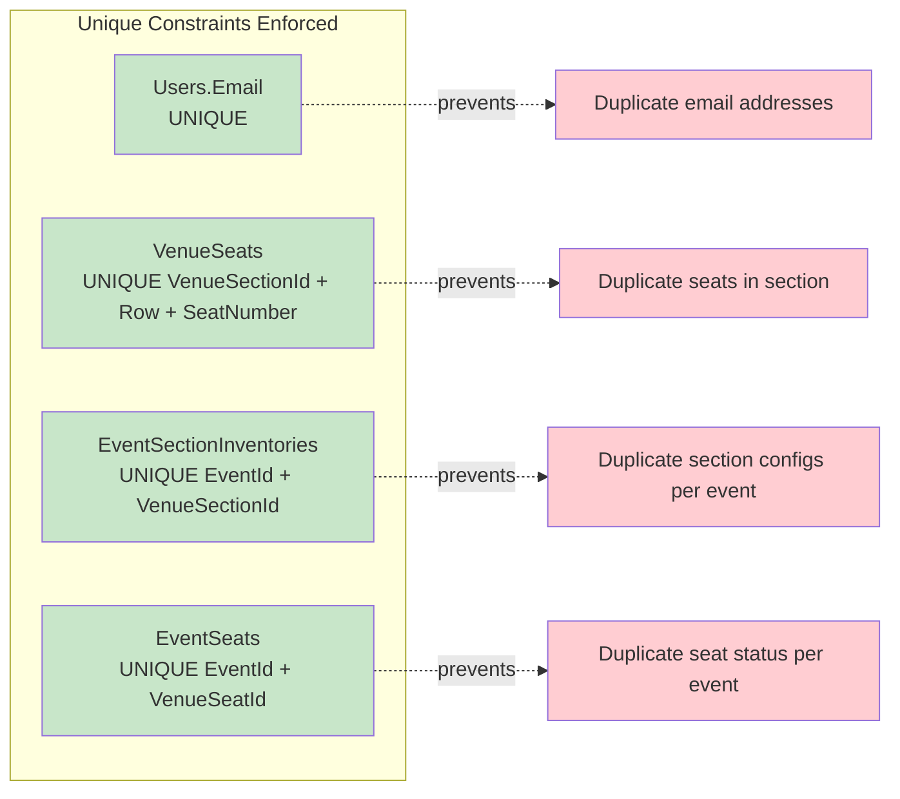

### Check Constraints

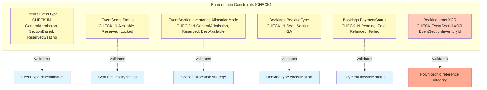

---

## Relationship Summary Table

### Complete Relationship Matrix

| Relationship | Parent Table | Child Table | Cardinality | Delete Behavior | Constraint Type | Notes |
|--------------|--------------|-------------|-------------|-----------------|-----------------|-------|
| **Venue Hierarchy** |
| 1 | **Venues** | **VenueSections** | 1:Many | CASCADE | FK, NOT NULL | Venue owns sections |
| 2 | **VenueSections** | **VenueSeats** | 1:Many | CASCADE | FK, NOT NULL, UNIQUE(SectionId, Row, Number) | Section owns seats |
| **Event Structure** |
| 3 | **Venues** | **Events** | 1:Many | CASCADE | FK, NOT NULL | Venue hosts events |
| 4 | **Events** | **EventSectionInventories** | 1:Many | CASCADE | FK, NOT NULL, UNIQUE(EventId, SectionId) | Event configures sections |
| 5 | **VenueSections** | **EventSectionInventories** | 1:Many | RESTRICT | FK, NOT NULL | References physical section |
| 6 | **Events** | **EventSeats** | 1:Many | CASCADE | FK, NOT NULL, UNIQUE(EventId, VenueSeatId) | Event manages seat status |
| 7 | **VenueSeats** | **EventSeats** | 1:Many | RESTRICT | FK, NOT NULL | References physical seat |
| **Booking Structure** |
| 8 | **Users** | **Bookings** | 1:Many | RESTRICT | FK, NOT NULL | User makes bookings |
| 9 | **Events** | **Bookings** | 1:Many | CASCADE | FK, NOT NULL | Event receives bookings |
| 10 | **Bookings** | **BookingItems** | 1:Many | CASCADE | FK, NOT NULL | Booking contains items |
| 11 | **EventSeats** | **BookingItems** | 1:Many | RESTRICT | FK, NULLABLE, XOR | Optional seat reference |
| 12 | **EventSectionInventories** | **BookingItems** | 1:Many | RESTRICT | FK, NULLABLE, XOR | Optional section reference |

### Relationship Type Distribution

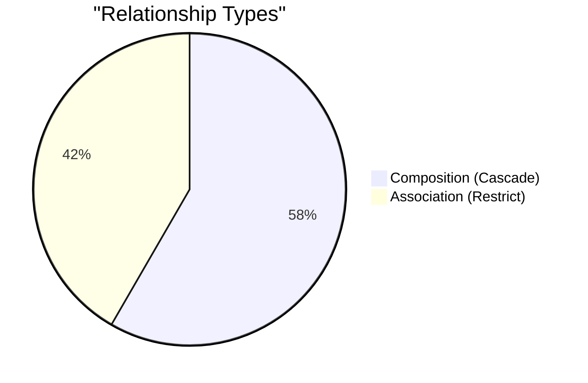

### Delete Behavior Summary

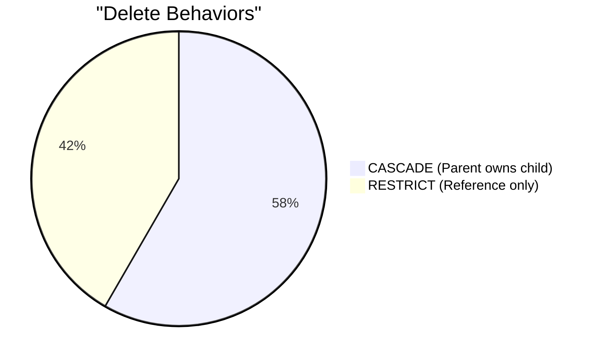

---

## Relationship Navigation Paths

### Common Query Patterns

#### Pattern 1: Find All Seats in a Venue
```
Venues ? VenueSections ? VenueSeats
```

#### Pattern 2: Find Event Availability (Section-Based)
```
Events ? EventSectionInventories ? VenueSections ? VenueSeats
```

#### Pattern 3: Find Event Availability (Reserved Seating)
```
Events ? EventSeats ? VenueSeats ? VenueSections ? Venues
```

#### Pattern 4: Find User's Bookings with Details
```
Users ? Bookings ? Events ? Venues
Users ? Bookings ? BookingItems ? [EventSeats OR EventSectionInventories]
```

#### Pattern 5: Find All Bookings for an Event
```
Events ? Bookings ? BookingItems
BookingItems ? EventSeats (if reserved seating)
BookingItems ? EventSectionInventories (if section-based)
```

---

## Visual Relationship Legend

### Cardinality Notation

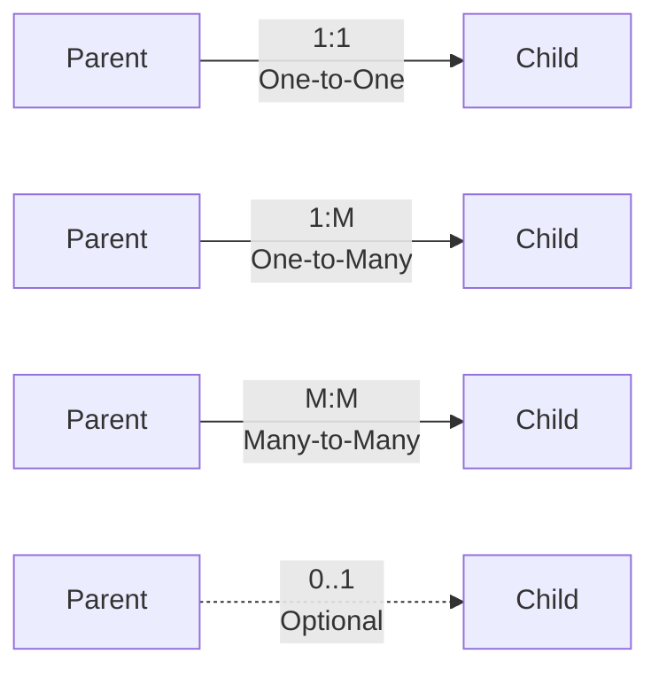

### Delete Behavior Notation

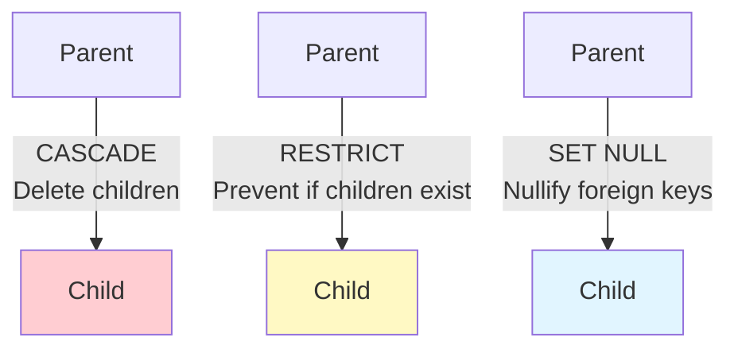

### Constraint Notation

| Symbol | Meaning |
|--------|---------|
| **PK** | Primary Key |
| **FK** | Foreign Key |
| **UK** | Unique Key |
| **NOT NULL** | Required Field |
| **NULLABLE** | Optional Field |
| **CHECK** | Value Constraint |
| **XOR** | Mutual Exclusivity |

---

## Key Relationship Insights

### Design Principles

1. **Composition vs Association**
   - **Composition** (CASCADE): Child cannot exist without parent (VenueSections, EventSeats, BookingItems)
   - **Association** (RESTRICT): Child can reference parent but has independent lifecycle (EventSectionInventories ? VenueSections)

2. **Physical vs Event-Specific**
   - **Physical**: VenueSeats, VenueSections (permanent venue infrastructure)
   - **Event-Specific**: EventSeats, EventSectionInventories (temporary event configuration)

3. **Polymorphic References**
   - **BookingItems** uses XOR constraint to reference different tables based on booking type
   - Enables flexibility while maintaining referential integrity

4. **Cascade Boundaries**
   - **Venue/Event hierarchy**: Aggressive cascade (administrative entities)
   - **User/Booking**: Restricted cascade (customer data protection)

5. **Unique Constraints**
   - Prevent duplicate physical infrastructure (seats, sections)
   - Prevent duplicate event configurations (one status per seat per event)
   - Enforce business rules at database level

---

## Related Documentation

- ?? **[DatabaseSchema-Diagram.md](./DatabaseSchema-Diagram.md)** - Complete schema visualization
- ?? **[CodeArchitecture-Diagrams.md](./CodeArchitecture-Diagrams.md)** - Code structure diagrams
- ?? **[SOLID-Principles-Overview.md](./SOLID-Principles-Overview.md)** - Design principles
- ?? **[CompleteSchema.sql](../tests/EventBookingSystem.Infrastructure.Tests/TestData/CompleteSchema.sql)** - DDL script

---

**Document Version:** 1.0  
**Last Updated:** 2025-01-XX  
**Database:** SQLite  
**Total Relationships:** 12 foreign key relationships  
**Cascade Chains:** 4 major deletion cascades  
