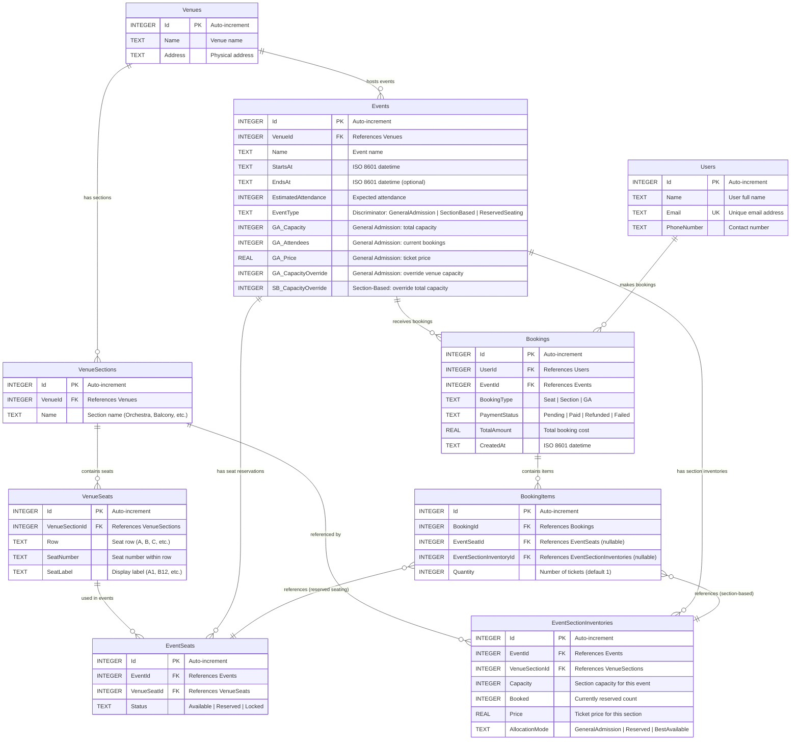
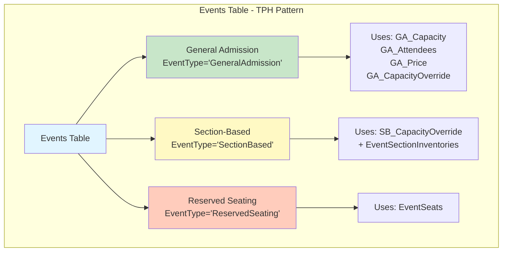
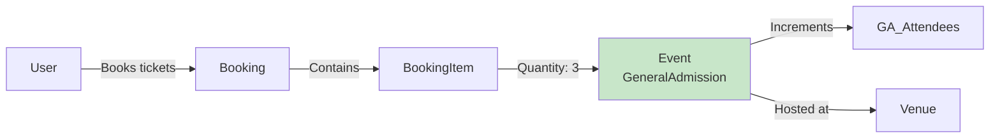
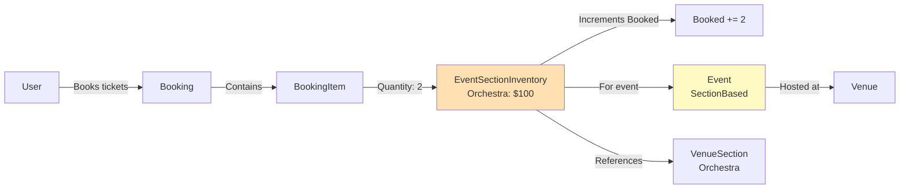
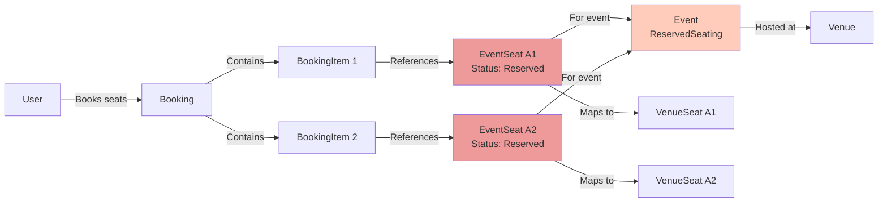
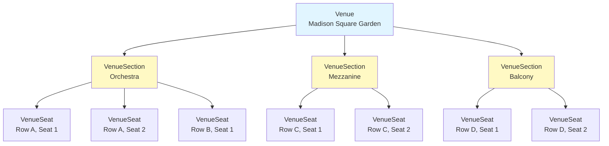
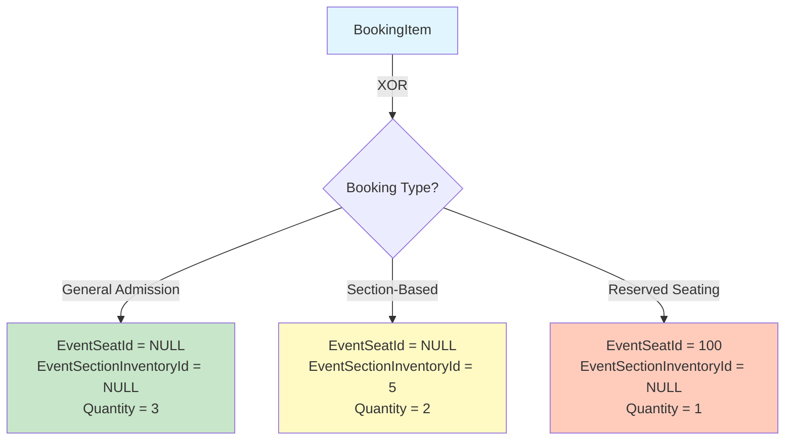
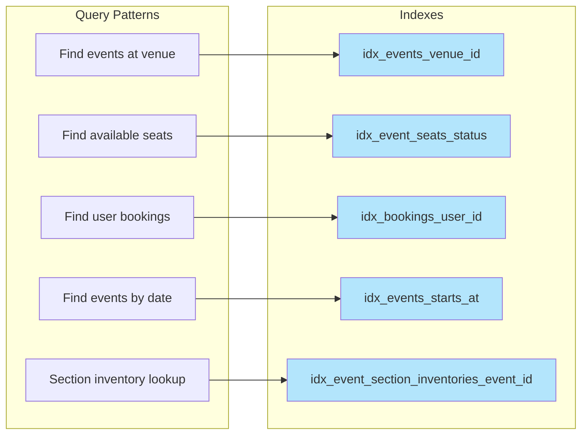
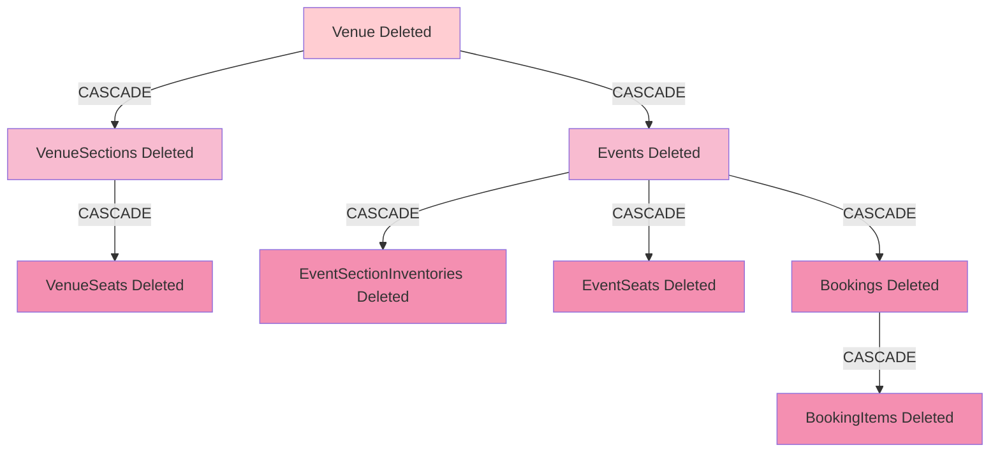
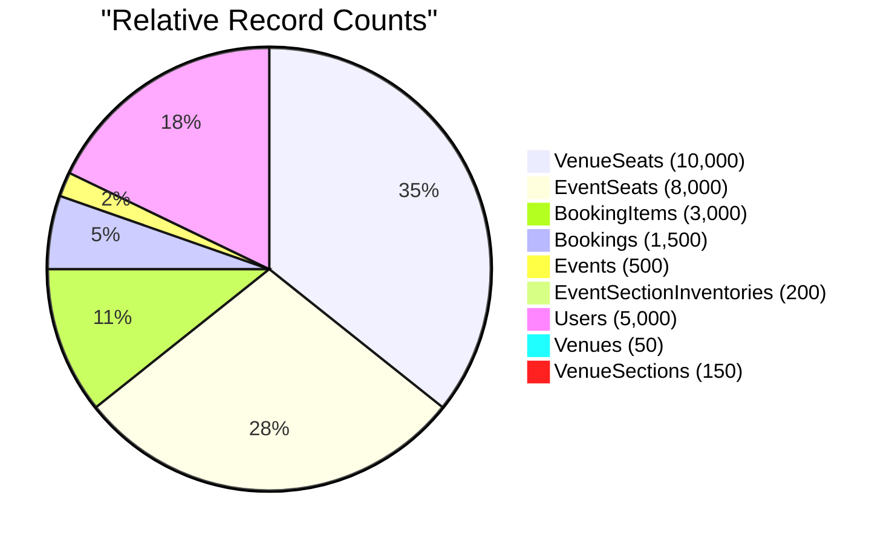

# Event Booking System - Database Schema Diagram

## Entity Relationship Diagram



---

## Database Architecture Overview

### Design Pattern: Table Per Hierarchy (TPH)

The **Events** table uses a discriminator pattern to store three event types in a single table:



---

## Data Flow Diagrams

### Flow 1: General Admission Booking



### Flow 2: Section-Based Booking



### Flow 3: Reserved Seating Booking



---

## Venue Hierarchy



---

## Booking Item Relationships

### Mutual Exclusivity Pattern



**Database Constraint**:
```sql
CHECK(
  (EventSeatId IS NOT NULL AND EventSectionInventoryId IS NULL) OR 
  (EventSeatId IS NULL AND EventSectionInventoryId IS NOT NULL) OR
  (EventSeatId IS NULL AND EventSectionInventoryId IS NULL)
)
```

---

## Index Strategy



---

## Cascade Delete Strategy



**Key Cascade Rules**:
- Deleting a **Venue** removes all sections, seats, events, and bookings
- Deleting an **Event** removes all inventories, seat reservations, and bookings
- Deleting a **Booking** removes all booking items
- Deleting a **User** does NOT cascade (must handle bookings separately)

---

## Event Type Comparison

| Feature | General Admission | Section-Based | Reserved Seating |
|---------|-------------------|---------------|------------------|
| **Table Used** | Events only | Events + EventSectionInventories | Events + EventSeats |
| **Capacity Management** | Simple counter | Per-section counters | Per-seat status |
| **Pricing** | Single price | Per-section pricing | Can vary by seat/section |
| **BookingItem References** | None (quantity only) | EventSectionInventoryId | EventSeatId |
| **Use Case** | Festivals, standing room | Theaters with tiered pricing | Concerts, sports with assigned seats |

---

## Schema Statistics

### Table Sizes (Typical Production)



---

## Normalization Level

The schema achieves **Third Normal Form (3NF)**:

? **1NF**: All attributes are atomic (no repeating groups)  
? **2NF**: All non-key attributes depend on the entire primary key  
? **3NF**: No transitive dependencies (no derived/calculated data stored)

**Key Design Decisions**:
- Capacity is **calculated**, not stored (from seat counts)
- Booked counts are stored for performance (denormalized for query optimization)
- TPH pattern trades some duplication for query simplicity

---

## Related Documentation

- ?? **[CompleteSchema.sql](../tests/EventBookingSystem.Infrastructure.Tests/TestData/CompleteSchema.sql)** - Full DDL script
- ?? **[SOLID-Principles-Overview.md](./SOLID-Principles-Overview.md)** - Design principles applied
- ?? **[DesignPrinciples.md](./DesignPrinciples.md)** - Comprehensive architectural guide

---

**Document Version:** 1.0  
**Last Updated:** 2025-01-XX  
**Database:** SQLite  
**Schema Version:** 1.0  
